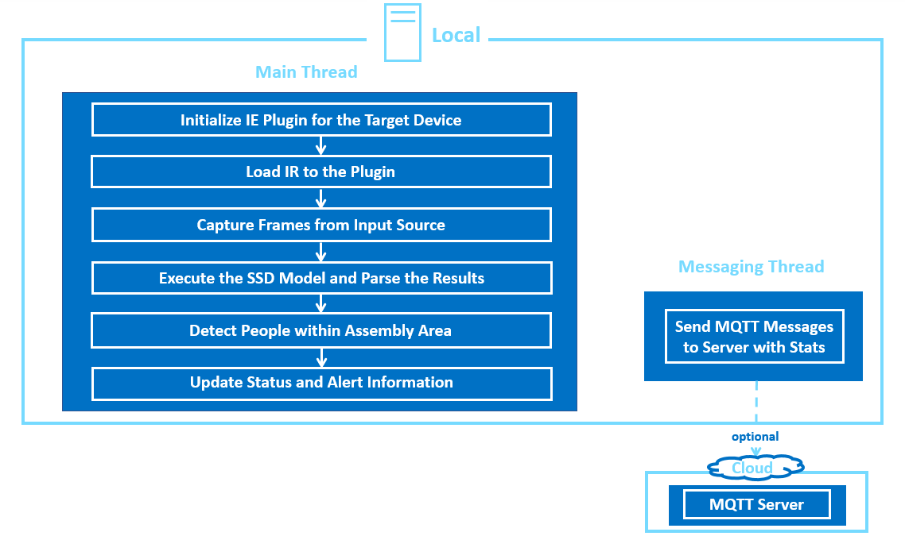

#People entry-exit Counter

This work is based on the Intel® sample application: Restricted Zone Notifier - https://github.com/intel-iot-devkit/restricted-zone-notifier-python.git

| Details            |              |
|-----------------------|---------------|
| Target OS:            |  Ubuntu\* 18.04 LTS   |
| Programming Language: |  Python* 3.5 |
| Time to Complete:    |  30 min     |


## What it does
This application is designed to detect the humans present at the entrance and exit of a building or area. If the people enters the marked area, it raises the alert (+1 for entry, -1 for exit) and sends through mqtt. It is intended to demonstrate how to use CV to monitor the number of people inside a building or area.

## Requirements

### Hardware

* UP Core Plus with Intel® Atom™ Quad Core processor and Intel® HD Graphics
 
### Software

* [Ubuntu\* 18.04 LTS](http://releases.ubuntu.com/18.04/)
  
* Intel® Distribution of OpenVINO™ toolkit 2019 R3 Release

* OpenCL™ Runtime package (see Intel® Distribution of OpenVINO™ toolkit setup on Linux)

## How It works

The 2 parallel applications included use the Inference Engine included in the Intel® Distribution of OpenVINO™ toolkit and the Intel® Deep Learning Deployment Toolkit. A trained neural network detects people within a marked area (one entry and one exit), which is designed for a machine mounted camera system. It sends an alert if there is one person detected in the marked area (+1 if the detected person crossed the entry area, -1 if the detected person crossed the exit area). The user can select the area coordinates either via command line parameters, or once the application has been started, they can select the region of interest (ROI) by pressing `c` key. This will pause the application, pop up a separate window on which the user can drag the mouse from the upper left ROI corner to whatever the size they require the area to cover. By default the whole frame is selected. People presence and alert signal data are sent to a local web server using the Paho MQTT C client libraries.
The program creates two threads for concurrency:

- Main thread that performs the video i/o, processes video frames using the trained neural network.
- Worker thread that publishes MQTT messages.<br>

Each application (entry and exit) can be represented by the following diagram:

<br>
**Architectural Diagram**

## Setup

### Get the code

Steps to clone the reference implementation:
```
sudo apt-get update && sudo apt-get install git
git clone https://github.com/AAEONAEU-SW/people-entry-exit-counter.git
``` 
### Install Intel® Distribution of OpenVINO™ toolkit

Refer to https://docs.openvinotoolkit.org/2019_R3.1/_docs_install_guides_installing_openvino_linux.html for more information about how to install and setup the Intel® Distribution of OpenVINO™ toolkit.

You will need the OpenCL™ Runtime package to run inference on the GPU. 
Be aware that the sample is designed to run one inference application on the CPU and one on the GPU.

### Other dependencies
#### Mosquitto*
Mosquitto is an open source message broker that implements the MQTT protocol. The MQTT protocol provides a lightweight method of carrying out messaging using a publish/subscribe model.

### Which model to use
Both inference applications use the [person-detection-retail-0013](https://docs.openvinotoolkit.org/2019_R3/_models_intel_person_detection_retail_0013_description_person_detection_retail_0013.html)
 Intel® pre-trained model, that can be accessed using the **model downloader**. The **model downloader** downloads the __.xml__ and __.bin__ files that will be used by the application.
 
To install the dependencies of the RI and to download the **person-detection-retail-0013** Intel® model, run the following command:

    cd <path_to_the_people-entry-exit-counter_directory>
    ./setup.sh 

The model will be downloaded inside the following directory:
 
    /opt/intel/openvino/deployment_tools/open_model_zoo/tools/downloader/intel/person-detection-retail-0013/

### The Config Files

The _resources/config.json_ (and config1.json) contains the path to the videos that will be used by the application.
The _config.json_ file is of the form name/value pair, `video: <path/to/video>`

Example of the _config.json_ file:

```
{

    "inputs": [
	    {
            "video": "videos/video1.mp4"
        }
    ]
}
```

### Using the Cameras

This is the default setup where the path/to/video in the _resources/config.json_  file (and config1.json) includes with the camera ID, where the ID is taken from the video device (the number X in /dev/videoX).   

On Ubuntu, list all available video devices with the following command:

```
ls /dev/video*
```

For example, if the output of above command is /dev/video0, then config.json would be::

```
{

    "inputs": [
	    {
            "video": "0"
        }
    ]
}
```


### Using Input video insead of cameras

Both inference applications work also with any input video. Find sample videos for object detection [here](https://github.com/intel-iot-devkit/sample-videos/).

For example config.json would be:

```
{

    "inputs": [
	    {
            "video": "sample-videos/video-file-name.mp4"
        }
    ]
}
```
To use any other video, specify the path in config.json (and config1.json) file


## Setup the environment (unless already added under .bashrc)
You must configure the environment to use the Intel® Distribution of OpenVINO™ toolkit one time per session by running the following command:

    source /opt/intel/openvino/bin/setupvars.sh
    
__Note__: This command needs to be executed only once in the terminal where the application will be executed. If the terminal is closed, the command needs to be executed again.
    
## Run the application

Change the current directory to the git-cloned application code location on your system:

    cd <path_to_the_people_entry_exit_counter_directory>/application_in 

or

    cd <path_to_the_people_entry_exit_counter_directory>/application_out 

To see a list of the various options:

    python3 people-entry-counter.py --help

or

    python3 people-exit-counter.py --help


### Running Entry Counter Application on the GPU

* To run the Entry Counter Application on integrated Intel® GPU with floating point precision 16 (FP16):
    ```
    python3 people_entry_counter.py -m /opt/intel/openvino/deployment_tools/open_model_zoo/tools/downloader/intel/person-detection-retail-0013/FP16/person-detection-retail-0013.xml -d GPU
    ```
    **FP16**: FP16 is half-precision floating-point arithmetic uses 16 bits. 5 bits for the magnitude and 10 bits for the precision. For more information, [click here](https://en.wikipedia.org/wiki/Half-precision_floating-point_format)

### Running Exit Counter Application on the CPU
When running Intel® Distribution of OpenVINO™ toolkit Python applications on the CPU,
the CPU extension library is required. This can be found at

    /opt/intel/openvino/deployment_tools/inference_engine/lib/intel64/


Though by default application runs on CPU, this can also be explicitly specified by  ```-d CPU``` command-line argument:

    python3 people_exit_counter.py -m /opt/intel/openvino/deployment_tools/open_model_zoo/tools/downloader/intel/person-detection-retail-0013/FP32/person-detection-retail-0013.xml -l /opt/intel/openvino/inference_engine/lib/intel64/libcpu_extension_sse4.so

### Other options for Entry/Exit Counter Applications 

To run the application on sync mode, use `-f sync` as command line argument. By default, the application runs on async mode.

You can select an area to be used as the "off-limits" area by pressing the `c` key once the program is running. A new window will open showing a still image from the video capture device. Drag the mouse from left top corner to cover an area on the plane and once done (a blue rectangle is drawn) press `ENTER` or `SPACE` to proceed with monitoring.

Once you have selected the "off-limits" area the coordinates will be displayed in the terminal window like this:

    Area Selection: -x=429 -y=101 -ht=619 -w=690

You can run the application using those coordinates by using the `-x`, `-y`, `-ht`, and `-w` flags to select the area.

For example:

    python3 people_exit_counter.py -m /opt/intel/openvino/deployment_tools/open_model_zoo/tools/downloader/intel/person-detection-retail-0013/FP32/person-detection-retail-0013.xml -l /opt/intel/openvino/inference_engine/lib/intel64/libcpu_extension_sse4.so -x 429 -y 101 -ht 619 -w 690

If you do not select or specify an area, by default the entire window is selected as the off limits area.

## Machine to Machine Messaging with MQTT

To use a MQTT server to publish data, you should set the following environment variables on a terminal before running the program:

    export MQTT_SERVER=localhost:1883
    export MQTT_CLIENT_ID=cvservice

Change the `MQTT_SERVER` to a value that matches the MQTT server you are connecting to.

You should change the `MQTT_CLIENT_ID` to a unique value for each monitoring station, so you can track the data for individual locations. For example:

    export MQTT_CLIENT_ID=zone1337

If you want to monitor the MQTT messages sent to your local server, and you have the `mosquitto` client utilities installed, you can run the following command in new terminal while executing the code:

    mosquitto_sub -h localhost -t People_entry_exit_counter
